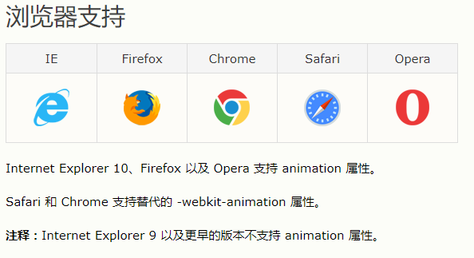

# slide
参加完css大会后的一些分享，主题是css动画，插件用了reveal

预览地址：[https://wxw1314.github.io/slide/](https://wxw1314.github.io/slide/)


## 何为动画

我们眼前所看到图像正在以每秒60次的频率刷新，由于刷新频率很高，因此你感觉不到它在刷新。而动画本质就是要让人眼看到图像被刷新而引起变化的视觉效果，这个变化要以连贯的、平滑的方式进行过渡。

## CSS Transitions

transition: property duration timing-function delay

### Transitions 四个属性
* transition-property：规定设置过渡效果的 CSS 属性的名称
* transition-duration：规定完成过渡效果需要多少秒或毫秒
* transition-delay：定义过渡效果何时开始
* transition-timing-function：规定速度效果的速度曲线，有以下参数：
    * ease:ease函数等同于贝塞尔曲线(0.25, 0.1, 0.25, 1.0).
    * linear:linear 函数等同于贝塞尔曲线(0.0, 0.0, 1.0, 1.0).
    * ease-in:ease-in 函数等同于贝塞尔曲线(0.42, 0, 1.0, 1.0).
    * ease-out:ease-out 函数等同于贝塞尔曲线(0, 0, 0.58, 1.0).
    * ease-in-out:ease-in-out 函数等同于贝塞尔曲线(0.42, 0, 0.58, 1.0)
    * cubic-bezier:特定的cubic-bezier曲线。 (x1, y1, x2, y2)四个值特定于曲线上点P1和点P2。所有值需在[0, 1]区域内，否则无效。可以在 [该网页](https://cubic-bezier.com/#.72,.19,.59,.38)中设置参数，形成过渡曲线。

### 演示
```css
div{
  height: 200px;
  width: 200px;
  background: green;
  transition: background 2s ease,transform 2s ease-in 1s;
}
div:hover{
  transform:rotate(180deg) scale(.5);background:red
}
```
请看[demo](https://codepen.io/wxw1314/pen/MRJoGa)

### 不足

transition的优点在于简单易用，但是它有几个很大的局限。

（1）transition需要事件触发，所以没法在网页加载时自动发生。

（2）transition是一次性的，不能重复发生，除非一再触发。

（3）transition只能定义开始状态和结束状态，不能定义中间状态，也就是说只有两个状态。

（4）一条transition规则，只能定义一个属性的变化，不能涉及多个属性。


## CSS ANIMATIONS

animation: name duration timing-function delay iteration-count direction;

### 七个属性

* animation-name：规定需要绑定到选择器的 keyframe 名称
* animation-duration：规定完成动画所花费的时间，以秒或毫秒计
* animation-timing-function：规定动画的速度曲线
* animation-delay：规定在动画开始之前的延迟
* animation-iteration-count：规定动画应该播放的次数(infinite：循环播放)
* animation-direction：规定是否应该轮流反向播放动画(normal,alternate：反向)
* animation-play-state：属性规定动画正在运行还是暂停。
    * paused：规定动画已暂停。
    * running：规定动画正在播放。
* animation-fill-mode：指定动画执行前后如何为目标元素应用样式
    * none：不改变默认行为
    * forwards：当动画完成后，保持最后一个属性值（在最后一个关键帧中定义）
    * backwards：在 animation-delay 所指定的一段时间内，在动画显示之前，应用开始属性值（在第一个关键帧中定义）
    * both：向前和向后填充模式都被应用

### 演示
* 在网页加载时自动发生
    ```css
    #myDiv {
      width:200px;
      height:200px;
      background:green
    }
    .play {
       animation: fancy 2s ease infinite alternate;
    /*   animation: fancy 2s ease alternate forwards; */
     }
    @keyframes fancy {
      0%   { transform: none; background:green;}
      40%  { transform: scale(0.75) rotate(90deg); }
      100% { transform: scale(0.5) rotate(180deg);background:red }
    }
    ```
* 增加restart按钮
    ```css
    @keyframes fancy1 {
      0%   { transform: none;background:green }
      40%  { transform: scale(0.75) rotate(90deg); }
    /*   45% {background:blue} */
      100% { transform: scale(0.5) rotate(180deg);background:red }
    }
    .restart {
       animation: fancy1 2s ease infinite alternate;
     }
    ```
    ```javascript
    function restart(){
      if (myDiv.classList.contains('play')) {
         myDiv.className = 'restart';
      }else {
        myDiv.className = 'play';
      }
    }
    ```
* 增加停止按钮
    ```css
    .pause {
       animation-play-state: paused;
     }
    ```
    ```javascript
    function pause(){
      if (myDiv.classList.contains('play')) {
         myDiv.className = 'pause play';;
      }else {
        myDiv.className = 'pause restart';
      }
    }
    ```
* *2倍速
    ```css
    .faster{
      animation: fancy 1s ease infinite alternate;
    }
    ```
    ```javascript
    function faster(){
      if (myDiv.classList.contains('play')) {
         myDiv.className = 'faster';
      }else {
        myDiv.className = 'faster restart';
      }
    }
    ```
    请看[demo](https://codepen.io/wxw1314/pen/wZqxPJ)
    
### 兼容性



 * -moz- /* 火狐等使用Mozilla浏览器引擎的浏览器 */
 * -webkit- /* Safari, 谷歌浏览器等使用Webkit引擎的浏览器 */
 * -o- /* Opera浏览器(早期) */
 * -ms- /* Internet Explorer (不一定) */
### 不足

如果需要多个动画需要随时的暂停，播放，反向播放，动态改变播放速率，监听到动画的完成和取消，需要用js来为css animation增加不同的样式从而改变动画，会让css文件和js文件太过于“笨重”

## Web ANIMATIONS

### 介绍
Web Animations API为开发者打开浏览器的动画引擎，让开发者可以通过JavaScript进行操作。该API旨在成为CSS动画和CSS过渡的实现的基础，并为未来的动画效果留下了空间。它是支持Web的动画最高效的方法之一，让浏览器可以自己进行内部优化而不需要hacks，强制或Window.requestAnimationFrame（）。

通过Web Animations API，我们可以将交互式动画从样式表移动到JavaScript，将表现与行为分开。我们不再需要依赖DOM-heavy的技术，例如编写CSS属性和将类作用于元素以控制播放方向。与纯粹的声明性CSS不同，JavaScript还允许我们动态地将值从属性设置为持续时间。

### 核心

其核心在于提供了:Element.animate(frames, timing);

**两个参数**
* 关键帧对象数组frames[]，对应CSS3中的@keyframes，每一帧的描述与css3极其类似,但它不需要明确告知动画中每个键出现的百分比。它会根据您给出的键数自动将动画分成相等的部分。也可以直接在对象中指定偏移量，CSS中的百分比偏移更改为offset从0到1的十进制值
* 时间控制timing，包括有duration持续时间、iterations执行次数、direction动画方向、easing缓动函数等属性
    ```js
    var options = {
        iterations: Infinity, // 动画的重复次数，默认是 1
        iterationStart: 0, // 用于指定动画开始的节点，默认是 0
        delay: 0, // 动画延迟开始的毫秒数，默认 0
        endDelay: 0, // 动画结束后延迟的毫秒数，默认 0
        direction: 'alternate', // 动画的方向 默认是按照一个方向的动画，alternate 则表示交替
        duration: 700, // 动画持续时间，默认 0
        fill: 'forwards', // 是否在动画结束时回到元素开始动画前的状态
        easing: 'ease-out', // 缓动方式，默认 "linear"
    };
    ```

### 方法和属性

* pause() – 暂停动画

* play() – 播放动画

* reverse() – 反向播放

* finish() – 立即结束动画

* cancel() – 取消动画并回到初始状态

* playbackRate – 播放速度（负数的话将导致动画反向运行）

```javascript
var myDiv = document.getElementById('myDiv');
var keyframes=[
   {transform: 'translateX(0)' },
   {transform: 'translateX(500px)'}
]
var timing={
  duration: 2000,
  // iterations: Infinity,
  direction: 'alternate'
}

let myAnimation=myDiv.animate(keyframes,timing);
// 播放动画
function play(){
  myAnimation.play();
}
// 暂停动画
function pause(){
  myAnimation.pause();
}
// 反向播放
function reverse(){
  myAnimation.reverse();
}
// 立即结束动画
function finish(){
  myAnimation.finish();
}
// 取消动画并回到初始状态
function cancel(){
  myAnimation.cancel();
}
// 2倍速
function faster(){
  myAnimation.playbackRate = 2;
}
// 反向运行动画
function back(){
  myAnimation.playbackRate = -1;
}
// 设置当前动画播放的毫秒数
function currentTime(){
  //currentTime返回动画当前所在的毫秒数,读/写
  myAnimation.currentTime=0;
}
```
请看[demo](https://codepen.io/wxw1314/pen/vMWoJL)

### WEB ANIMATION API 事件监听
* onfinish:用于注册完成事件，当调用finish()方法是也可以触发。
* oncancel:用于注册取消事件，当调用cancel()方法是也可以触发。

```javascript
spinnerAnimation.addEventListener('finish', function() {
    // Animation has completed or .finish() has been called.
    doSomething();
});

spinnerAnimation.addEventListener('cancel', function() {
    // Animation has been canceled.    
    doSomething();
});
```
### 兼容性


* 可以引进 [polyfill (web-animations-js)](https://user-gold-cdn.xitu.io/2019/8/9/16c7591062be44f1)，但也只能兼容到ie>=11

* 移动端浏览器，Android 5.0以上的Android Browser和Chrome for Android本身就已经支持WAAPI了，加上Polyfill之后，iOS的Safari也支持了。

## web animation 和 css animation 的区别

1，在css animation中animation-timing-function适用于关键帧之间

2，在web animation中animation-timing-function适用于整个动画过程

3，如果想要在web animation中animation-timing-function也适用于关键帧之间，可以在关键帧上加上easing属性（可以不同）


请看[demo](https://codepen.io/wxw1314/pen/OGxMXx)

## 性能

**Try to animate transform and opacity**

对于动画的每一帧，浏览器都要重新计算元素的形状位置（reflow），把新状态渲染出来（repaint），再显示到屏幕上,而transform和opacity这两个属性有其特殊性：

1,does not affect the document’s flow,(不影响布局)

2,does not depend on the document’s flow,(不受布局影响)

3,does not cause a repaint.(变化不会导致其它部分需要repaint)

所以浏览器能百分百肯定transform和opacity的变化与布局无关，不受布局影响，其变化也不会影响现有布局


